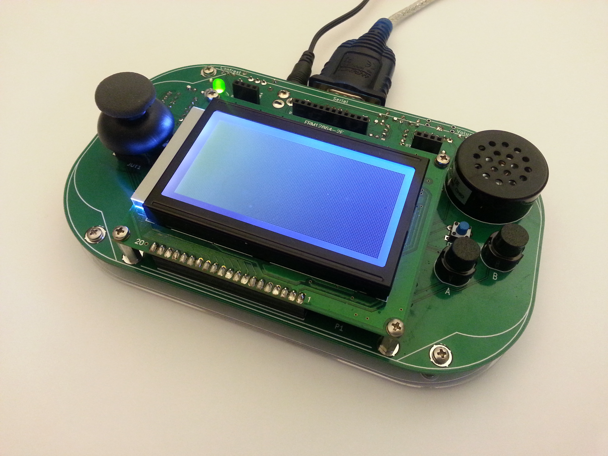

Your game. Your console. Your move.

Sure, you've played it before: game boy, game gear,  DS, PSP and how many others? What now? What do you do next?  Have you ever wanted to go further? Have you ever wanted to learn everything there is to know about these devices? How they're made? How they work? How they go from a brick on a table to hours and hours of interactive fun?

Well now you can, with the LameStation. The LameStation is a gaming handheld designed for someone who wants to do more than just play. The LameStation is for someone who wants to do,  to create. Someone with insatiable curiosity who wants to know everything about the world around you. If that sounds like you, this product is for you.

The LameStation is simple, straightforward, designed using simple circuits that could be found in any Intro to EE textbook, and using a programming language,  Spin, that is easy yet powerful.

## Hardware Features

The LameStation is a true do-it-yourself kit, and must be assembled completely from scratch. Though not as small and sleek as it's surface mount brethren, this console is nothing to laugh about.

* 8-core Parallax Propeller P8X32A microcontroller clocked at 80MHz
* Monochrome 128x64 graphic LCD
* 8Ω audio amplifier with switching headphone output and speaker
* 32kB EEPROM
* Programmable via USB with the included USB-to-serial cable
* Powered by 4 AAA batteries or included AC power adapter
* 8-pin expansion port

## Software Features

The LameStation SDK provides a complete set of libraries, content tools, demos, royalty free graphics and audio, and everything else you need to jumpstart your game.

* 3-color framebuffer display driver for monochrome LCDs
* Fast assembly graphics library with tiles,  sprites, and bitmap text support
* 4-voice polyphonic synthesizer with ADSR filtering
* 6 waveform types: sine, square, triangle, sawtooth, white noise, and 512-byte sample playback
* Control library for handling user input
