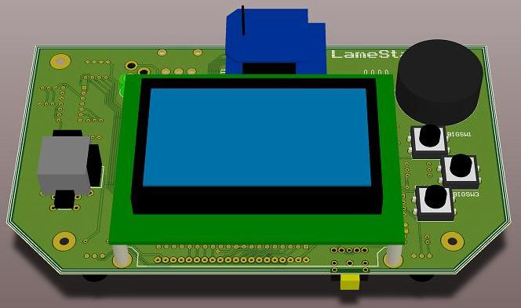
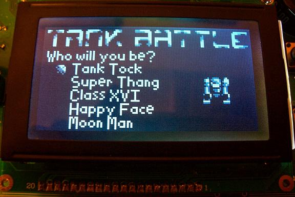
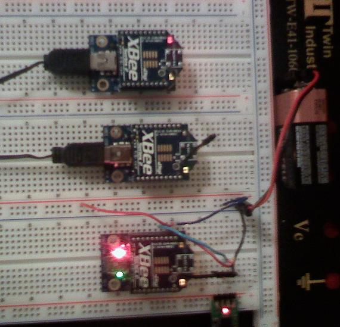
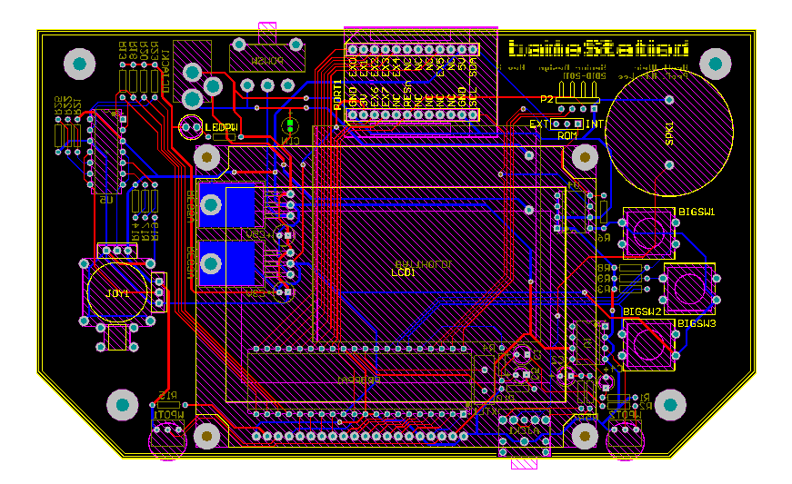

    
    
    
    
    



# Meet The LameStation

- {{ page.id }}
- {{ page.url }}
- {{ page.title }}
- {{ page.group }}



 
- {{ node }} - {{ forloop.first }}
 

 

   
  - {{ subnode }} - {{ forloop.first }}
   

   

    - {{ subsubnode }} - {{ forloop.first }}

   
 





The LameStation is a gaming handheld designed with ease of software development and flexibility in mind. Leveraging the Parallax Propeller's 8-core architecture and established user base, the LameStation is a valuable tool for embedded systems and electronics education, teaching core concepts in context, using targeted, project-oriented lessons for true understanding.

The free-form paradigm and 8-pin expansion port mean easy repurposing of the hardware to new applications, so the user isn't limited to just games. 

Possibilities include:

* Digital oscilloscope
* Chat client
* Tone module
* Radio controller
* TV game console

<strong>What will you create with the LameStation?</strong>
